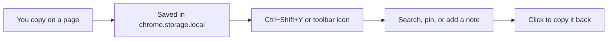

# Simple Clipboard Manager

Clipboard history that never leaves your machine. Copy as usual, open the popup, find it again. No account, no cloud, no analytics.

**[Install from Chrome Web Store](https://chromewebstore.google.com/detail/simple-clipboard-manager/boobajgiodbcfkpehnabpphaiolahgmj)** · [Privacy policy](PRIVACY_POLICY.md) · MIT

## What it looks like

The popup is a small panel next to the toolbar:

- **Recent** — everything you copied, newest first
- **Pinned** — up to 15 items that stay on top and are never auto-deleted
- **Settings** — auto-save, toasts, skip passwords, ignored sites

Each row is the copied text, a relative time, and two icons on the right: a **note** (speech bubble) and a **pin** (star). Links get an open-in-tab button; hex/RGB/HSL values show a color dot.

Click a row to put that text back on the clipboard. The note is only a label. It is not copied.

## How it works



1. You copy with Ctrl+C, or right-click selected text and choose **Save to Clipboard Manager**.
2. The extension stores the text on this browser profile only. Password fields are skipped unless you turn that off. Sites you list in Settings are skipped too.
3. Open the popup with **Ctrl+Shift+Y** (change it under `chrome://extensions/shortcuts`). On Windows, Alt+Shift is reserved for switching keyboard layout, so it is not used.
4. Search matches both the copied text and your notes. Same text copied again moves to the top and **keeps the note**.

Nothing is sent to a server. You can confirm that in the [source](https://github.com/opzozi/simple-clipboard-manager).

## What you can do

| Action | How |
| --- | --- |
| Copy an old item back | Click the row, or select it with arrow keys and press Enter |
| Remember what a code was | Bubble icon → type a note (e.g. "login code, Friday") → Enter |
| Keep something permanently | Star it. Pinned items ignore the 500-item cap |
| Open a copied URL | Link icon on that row |
| Find something | Search box; matches text and notes |
| Stop saving on a site | Settings → Ignored sites, one domain per line |
| Wipe history | Trash in the header, or Clear all data in Settings |

Limits: **500** items (oldest unpinned drop off), **15** pins, **280** characters per note, **50 000** characters per item.

## Shortcuts

| Key | Action |
| --- | --- |
| Ctrl+Shift+Y | Open the popup |
| Arrow up / down | Move between items |
| Enter | Copy the selected item |
| Escape | Clear selection, or clear search if the search box is focused |

## Privacy

Data lives in `chrome.storage.local` on your computer. Permissions are only `storage`, clipboard read/write, context menus, and page access so copy events can be detected. Details: [PRIVACY_POLICY.md](PRIVACY_POLICY.md).

## Install from source

Node.js 18+.

```bash
npm install
npm run build
```

Chrome or Vivaldi → `chrome://extensions/` → Developer mode → Load unpacked → select the `dist` folder. `npm run dev` rebuilds on change.

Store listing copy (short + long text to paste): [CHROME_WEB_STORE.md](CHROME_WEB_STORE.md).

## Later: Pro, still offline

If a paid tier happens, it stays local: text expander, encrypted backup file, image history, more pins, floating window. No sync account.

## Links

- Website: https://scm.opzozidev.com
- Chrome Web Store: https://chromewebstore.google.com/detail/simple-clipboard-manager/boobajgiodbcfkpehnabpphaiolahgmj
- Donate: https://www.paypal.com/donate/?hosted_button_id=KSNA8YZWGMDFG

## License

MIT
